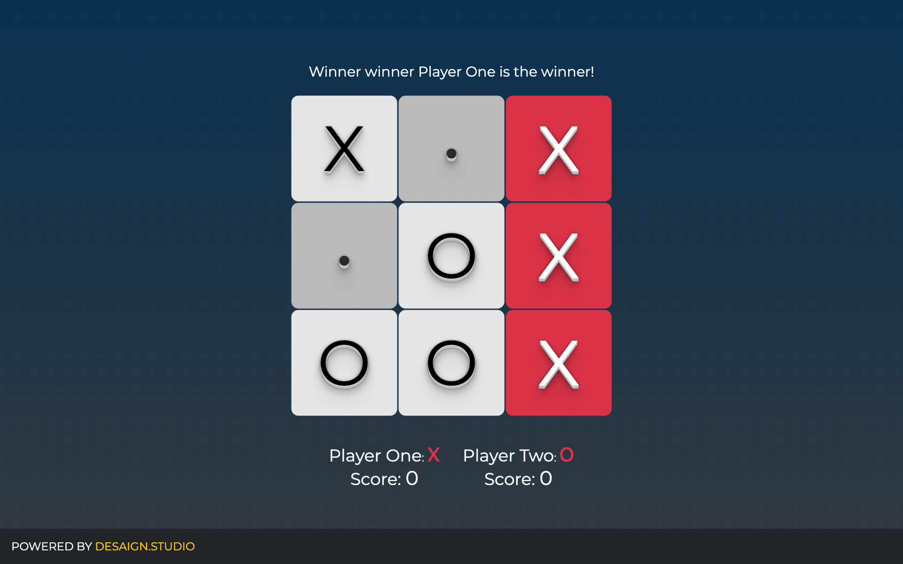

## Tic-Tac-Toe by Desaign Studio

Tic-tac-toe (American English), noughts and crosses (Commonwealth English and British English), or Xs and Os/“X’y O’sies” (Ireland), is a paper-and-pencil game for two players, X and O, who take turns marking the spaces in a 3×3 grid. The player who succeeds in placing three of their marks in a diagonal, horizontal, or vertical row is the winner.

### Gameplay

A player must place three of their marks in a horizontal, vertical, or diagonal row to win the game. The score adds once the player wins the game.

### Version

- **2103231153**
  ✔ Last Update @done (March 23rd 2021, 14:41)

### Framework

- HTML5, CSS3, JavaScript

### Built With

- JQuery, Bootstrap, Google Fonts, SVG

### Software

- Visual Studio Code Editor
- Github for versioning

### CONTRIBUTE

- A [contributing guideline](https://github.com/kratuvwxyz/CONTRIBUTE) available.

### LICENSE

- [MIT](https://github.com/kratuvwxyz/LICENSE) © 2021 Kratu Desai, DESAIGN LLC.

## CONTACT

Thank you for your time and consideration. My mantra is simple, _chase perfection to catch excellence_. I hope you enjoy my work. **I'd love to hear from you.** Please email me at <a href="mailto:github@desaign.studio?Subject=Message from Github">github@desaign.studio</a>.

 &copy; 2011-2021. <a href="https://desaign.app" target="_blank" style="text-decoration:none;">DESAIGN STUDIO</a>. All Rights Reseverd. &#160;
 &#160;
 &#160;
 &#160;
 &#160;
